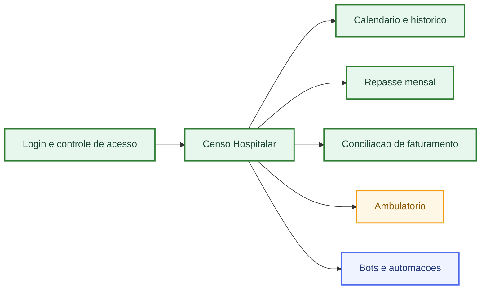
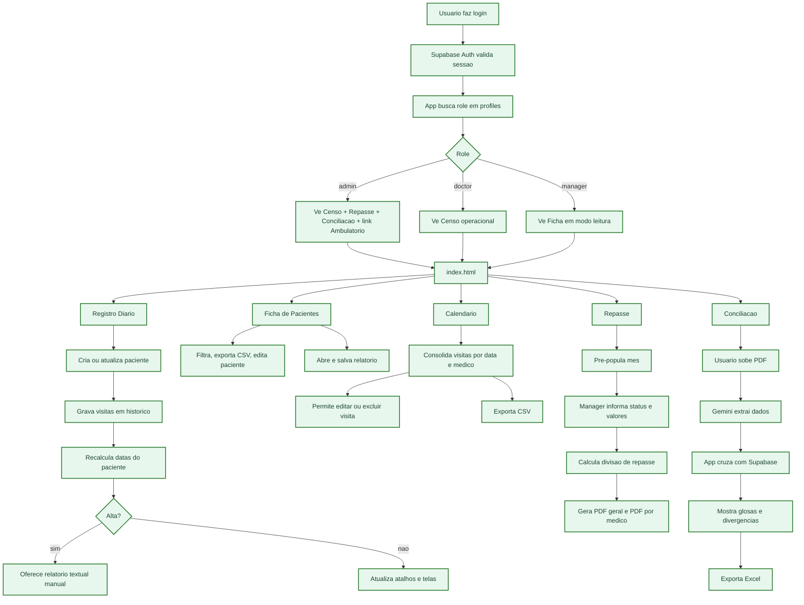
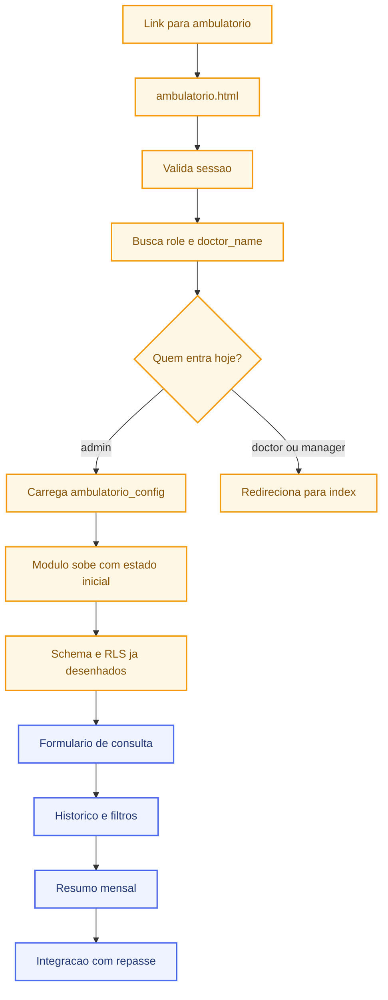
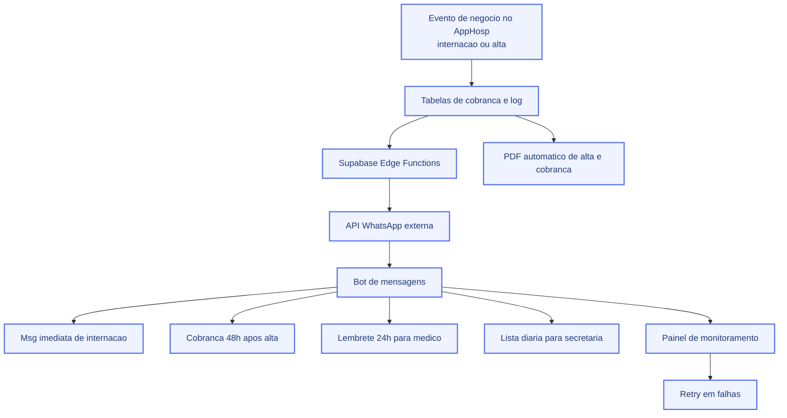

# AppHosp — Mapa Visual de Funcionamento

## Como ler

- `ATUAL` = ja implementado no projeto
- `PARCIAL` = existe base tecnica, mas nao esta completo
- `PLANEJADO` = esta no roadmap, ainda nao operacional

## Resumo executivo

Hoje o AppHosp funciona de verdade como:

- `Login + Censo hospitalar + Calendario + Repasse + Conciliacao`

As proximas camadas sao:

- `Ambulatorio`, que ja entrou no repositorio, mas ainda esta incompleto
- `Bots + WhatsApp + automacoes`, que estao planejados, mas ainda nao implementados

---

## 1. Visao geral do produto

---

## 2. Fluxo operacional atual

---

## 3. Ambulatorio: onde ele entra

---

## 4. Bots e automacoes: arquitetura planejada

---

## O que esta implementado x o que esta so no plano

### Implementado hoje

- login com Supabase
- RBAC por role
- registro diario de visitas
- ficha de pacientes
- calendario por medico e dia
- repasse mensal com PDFs
- conciliacao com PDF + Gemini + Excel

### Parcial

- pagina e bootstrap do ambulatorio
- migration executavel do schema do ambulatorio
- desenho de RLS e rollout de auth medico

### Ainda planejado

- cobrancas estruturadas
- Edge Functions para comunicacao
- integracao WhatsApp
- bots
- automacoes por delay e cron
- monitoramento e retry de envios

---

## Onde abrir o Mermaid

### Opcao 1: abrir a versao pronta no navegador

Abra este arquivo:

- [fluxograma-funcionamento-apphosp.html](/Users/igorcampana/projetos_programacao/AppHosp/docs/fluxograma-funcionamento-apphosp.html)

### Opcao 2: colocar num lugar que renderiza Mermaid

Funciona bem em:

- GitHub README ou arquivo `.md` dentro do repo
- Obsidian
- Notion com bloco Mermaid
- Mermaid Live Editor

### Opcao 3: colar no Mermaid Live Editor

Cole qualquer um dos blocos acima em:

- `https://mermaid.live`

---

## Fonte deste alinhamento

- `script.js`
- `login.js`
- `repasse.js`
- `conciliacao.js`
- `ambulatorio.js`
- `ambulatorio.html`
- `README.md`
- `AppHosp_v2_Plano_de_Fases.md`
- `scripts/fase1-migration-execute.sql`
