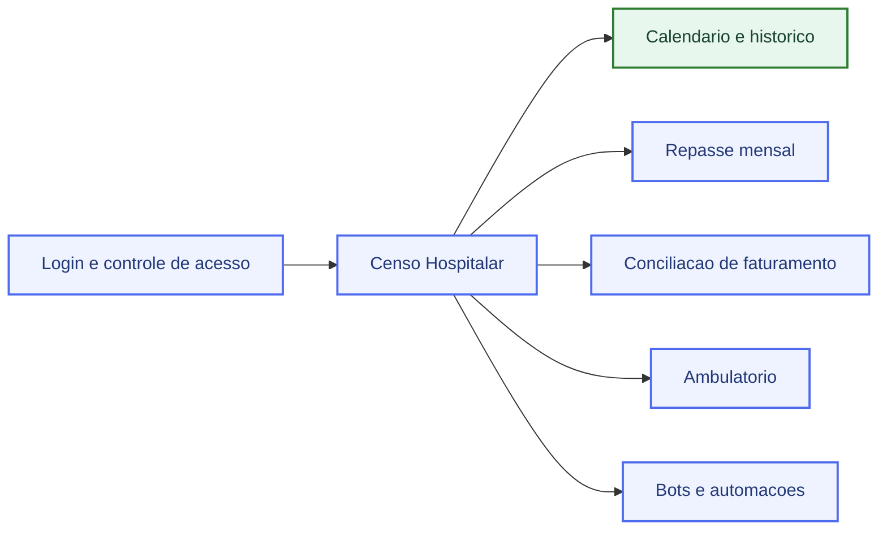
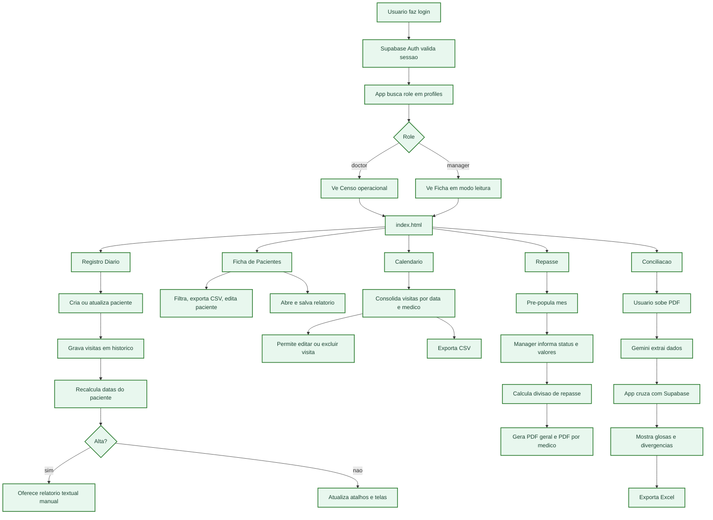
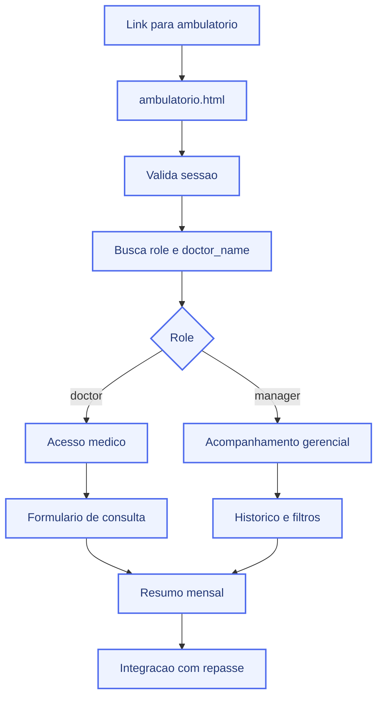
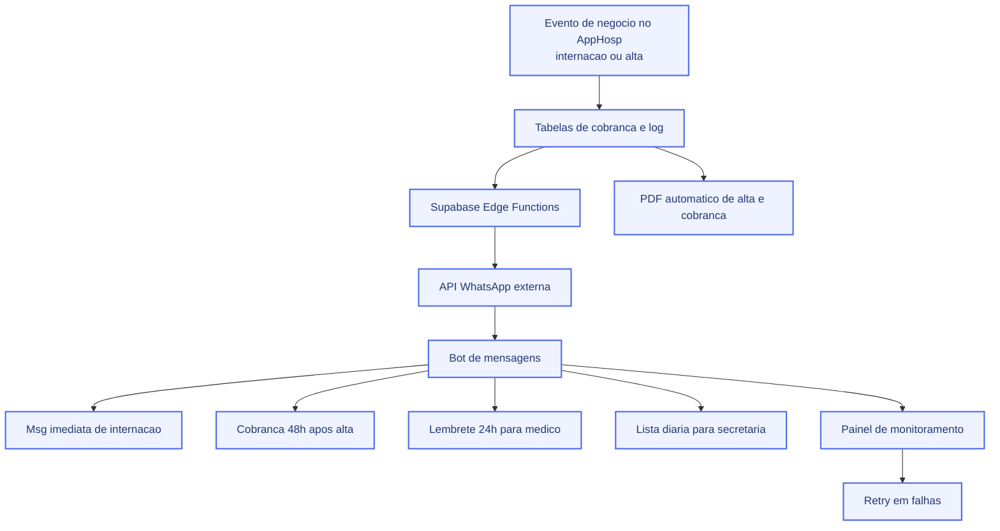

# AppHosp — Mapa Visual de Escopo

## Como ler

- `FEITO` = pronto para apresentacao
- `PLANEJADO` = entra no roadmap das proximas etapas

## Resumo executivo

Para apresentacao comercial, o AppHosp esta organizado em:

- `Calendario + historico` como entrega ja pronta

As proximas camadas sao:

- `Login + Censo hospitalar + Repasse + Conciliacao + Ambulatorio`
- `Bots + WhatsApp + automacoes`

---

## 1. Visao geral do produto

---

## 2. Fluxo operacional

---

## 3. Ambulatorio: onde ele entra

---

## 4. Bots e automacoes: arquitetura planejada

---

## O que esta feito x o que esta no plano

### Feito

- calendario por medico e dia
- historico operacional

### Planejado

- login com Supabase
- RBAC por role doctor e manager
- registro diario de visitas
- ficha de pacientes
- repasse mensal com PDFs
- conciliacao com PDF + Gemini + Excel
- ambulatorio
- cobrancas estruturadas
- Edge Functions para comunicacao
- integracao WhatsApp
- bots
- automacoes por delay e cron
- monitoramento e retry de envios

---

## Onde abrir o Mermaid

### Opcao 1: abrir a versao pronta no navegador

Abra este arquivo:

- [fluxograma-funcionamento-apphosp.html](/Users/igorcampana/projetos_programacao/AppHosp/docs/fluxograma-funcionamento-apphosp.html)

### Opcao 2: colocar num lugar que renderiza Mermaid

Funciona bem em:

- GitHub README ou arquivo `.md` dentro do repo
- Obsidian
- Notion com bloco Mermaid
- Mermaid Live Editor

### Opcao 3: colar no Mermaid Live Editor

Cole qualquer um dos blocos acima em:

- `https://mermaid.live`

---
